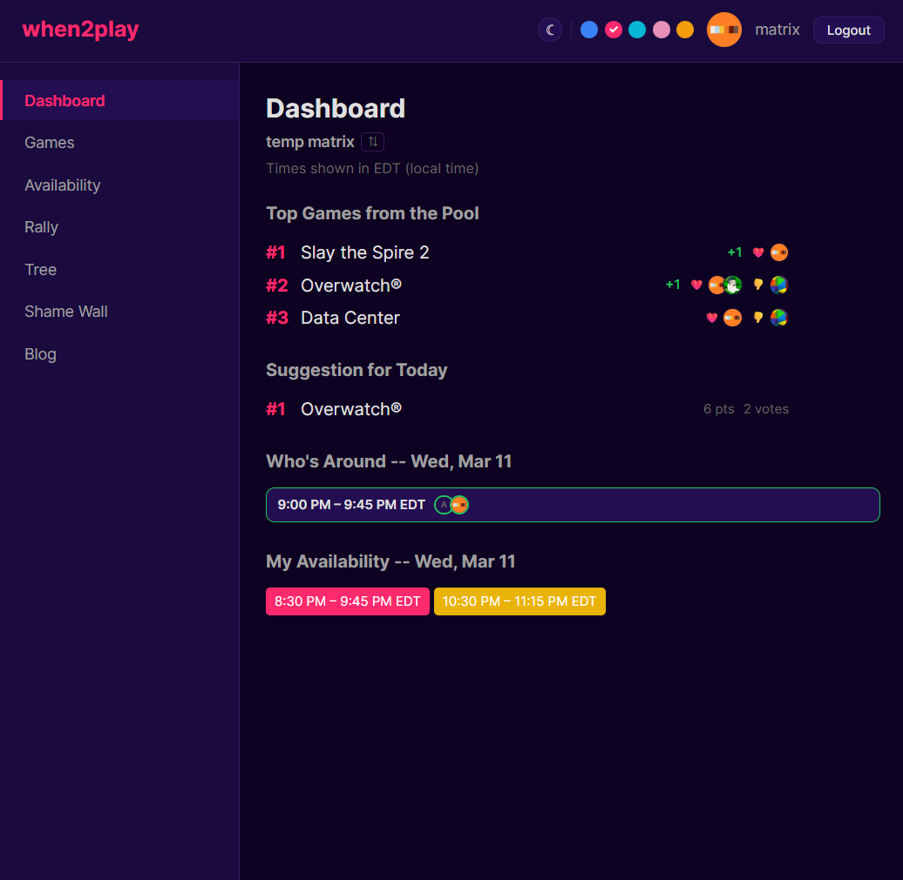
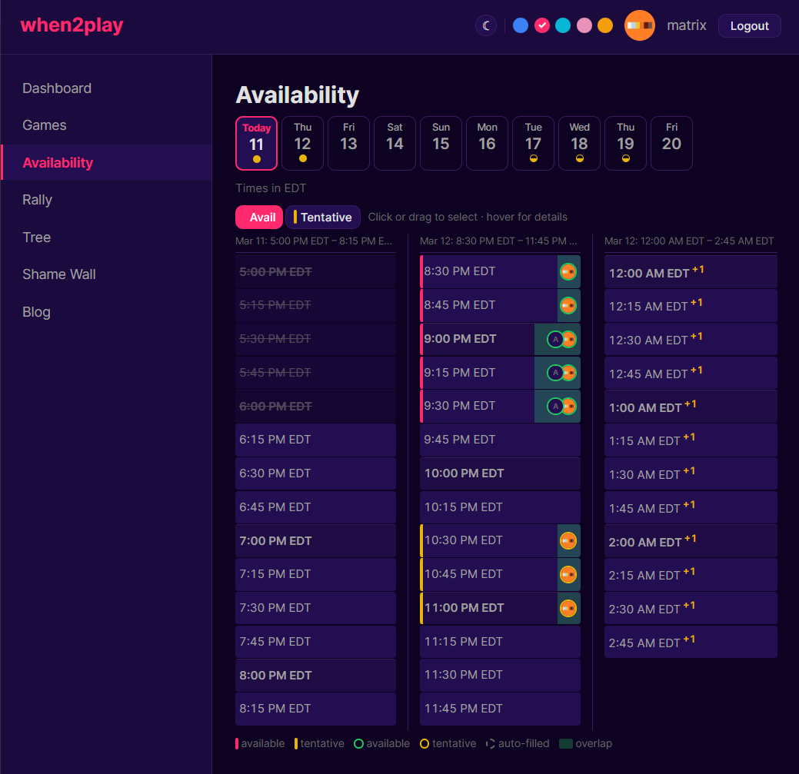

# when2play

Async game-session scheduling for friend groups, with Discord integration. Propose games, rank-vote, set availability, and coordinate play sessions from a browser dashboard.

<table>
<tr>
<td></td>
<td></td>
</tr>
</table>

## User Documentation

Guides for setting up, deploying, and operating when2play.

| Document | Description |
|----------|-------------|
| [Local Testing](docs/user/LOCAL_TESTING.md) | Run the project locally for development and testing |
| [Deployment](docs/user/DEPLOYMENT.md) | First-time production deployment (Cloudflare Worker + Discord bot) |
| [Maintenance](docs/user/MAINTENANCE.md) | Adding guilds, running migrations, key rotation, troubleshooting |
| [Security](docs/user/SECURITY.md) | Authentication, cookies, input validation, attack surface |

## Developer Documentation

Technical references for understanding and extending the codebase.

| Document | Description |
|----------|-------------|
| [Architecture](docs/dev/ARCHITECTURE.md) | Codebase structure, database schema, multi-guild design, frontend layout |
| [API Reference](docs/dev/API.md) | Complete HTTP API with request/response examples |
| [Bot Contract](docs/dev/BOT_CONTRACT.md) | Integration spec for building a companion Discord bot |
| [Future Design](docs/dev/FUTURE.md) | Cloudflare-native bot migration guide (HTTP Interactions + Cron Triggers) |

## Quick Link

- [Cloudflare Dashboard](https://dash.cloudflare.com)
- [Discord Developer Portal](https://discord.com/developers/applications)
