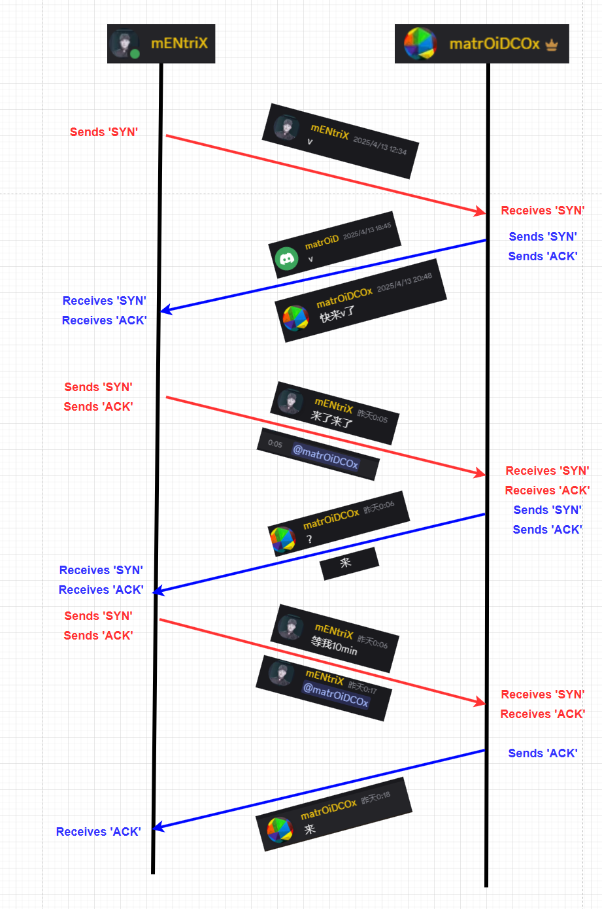

# The Gaming Tree: When Scheduling Feels Like a TCP Handshake

*February 2026*

## The Problem

If you've ever tried to get 4-5 friends online at the same time, you know the drill. Someone drops a "play tonight?" in Discord at 2 PM. Three hours pass. Someone says "maybe." Two more hours. Another person says "I'm in after dinner." By 9 PM you've got three people ready, one who went AFK, and one who forgot they said yes.

This is a coordination problem, and it turns out it looks a lot like something computer scientists already solved in the 1970s.



## TCP: The Original "Let's Play"

When two computers want to talk to each other, they do a three-way handshake:

```
Client  ──SYN──>  Server     "Hey, wanna connect?"
Client  <─SYN-ACK─ Server     "Yeah, I'm here!"
Client  ──ACK──>   Server     "Great, let's go."
         ═══ CONNECTION ESTABLISHED ═══
```

Now look at how a typical gaming session gets organized:

```
Player1 ──CALL──> Group      "let's play!"
Player2 ──IN────> Group      "I'm in!"
Player3 ──IN────> Group      "me too!"
          ═══ SESSION ESTABLISHED ═══
```

The parallel is uncanny. A `/call` is a SYN packet. Each `/in` is a SYN-ACK. When enough people respond, the session is established.

## When Things Go Wrong: Packet Loss

In TCP, packets get lost. You get retransmissions, timeouts, RST packets. Gaming coordination has its own version:

```
Player1 ──CALL──> Group      2:00 PM
          ... silence ...       (packet loss)
Player1 ──PING──> Player2    4:30 PM  (retransmission)
Player2 ──BRB───> Group      4:45 PM  (partial ACK)
Player1 ──WHERE─> Player2    6:00 PM  (keepalive probe)
Player2 ──IN────> Group      6:15 PM  (delayed ACK)
Player3 ──OUT───> Group      6:20 PM  (RST / connection refused)
```

Some days look like clean three-way handshakes. Others look like packet loss with retransmissions scattered everywhere. The `/ping` command is literally a retransmission — "I sent you a SYN, where's my ACK?"

## The Rally System

The rally system standardizes these ad-hoc chat patterns into formal "moves" in a game tree. Eight actions cover the full vocabulary of session coordination:

```
/call   SYN        Initiate a session
/in     SYN-ACK    Accept the invitation
/out    RST        Refuse / disconnect
/ping   Retransmit Resend to specific user
/brb    Window=0   Temporarily unavailable
/where  Keepalive  Check if peer is still there
/judge  DNS        System resolves best timing
/tree   Wireshark  Visualize the whole exchange
```

## The Gaming Tree

The Gaming Tree takes these interactions and renders them as a directed acyclic graph — like an extensive-form game tree from game theory. Each node is an action, each edge is a causal relationship. Calls branch into responses. Pings create targeted edges. The judge adds system nodes.

It's part network diagram, part game tree, part social graph. And at the end of the day, you can look back and see exactly how your group went from "anyone around?" to "GG."

## A Day in the Life

Here's what a typical evening coordination looks like, visualized:

```
                                ┌─ ✅ Player2: in ──┐
   📢 Player1: call (later) ───┤                    ├─── 🎮 Session!
                                ├─ ⏳ Player3: brb  ─┤
                                │        │           │
                                │   ❓ Player1       │
                                │   → Player3: where │
                                │        │           │
                                │   ✅ Player3: in ──┘
                                │
                                └─ ❌ Player4: out
                                   "gotta study"
```

Three-way handshake established between Players 1, 2, and 3. Player 3 had a partial failure (BRB) requiring a keepalive probe (WHERE), but eventually ACK'd. Player 4 sent a RST with reason.

---

The gaming tree won't solve the fundamental coordination problem — people are still going to be busy, forget, or get distracted. But it gives structure to the chaos, and turns an evening of "u there?" messages into something you can actually look back at and laugh about.

Try `/call` in Discord or hit the Rally tab to get started.
